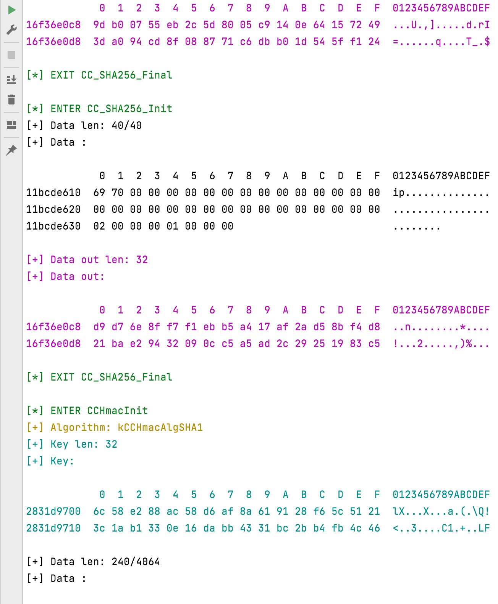

# Frida-iOS-Cipher

## Introduction
Intercept all cryptography-related functions on iOS with Frida Api.
## Support Algorithm
* [x] `AES`
* [x] `DES`,`3DES`
* [x] `CAST`(What it's?)
* [x] `RC2`,`RC4`
* [x] `Blowfish`
* [x] `SHA1`,`SHA224`,`SHA256`,`SHA384`,`SHA512`
* [x] `MD2`,`MD4`,`MD5`
* [x] `HMAC`
* [x] `PBKDF`
## Preview

## Instructions for use
* You can customize the functions you want to intercept printing by turning them on (they are all turned on by default).
* Print data limit (default maximum 240 bytes for a single piece of data, where there is no limit for key, hash and digest results)
* and stack information (off by default)
* Doesn't differentiate between OC or Swift, the api calls for encryption are the same for both languages

## Simple to use

* Spawn mode

```bash
frida -U --codeshare Humenger/frida-ios-cipher -f "xxx.xxx.xxx" --no-pause
```

* Attach mode

```bash
frida -U --codeshare Humenger/frida-ios-cipher -n "app name"
```
## Config
> Configuration at the beginning of the [script](./agent/index.ts).
```js
//config
const CIPHER_CONFIG={
    "enable":true,//global enable
    "highlighting": true,//syntax highlighting
    "crypto":{
        "enable":true,//crypto enable
        "maxDataLength":240,//Maximum length of single data printout
        "printStack":false,
        "aes":true,
        "des":true,
        "3des":true,
        "cast":true,
        "rc4":true,
        "rc2":true,
        "blowfish":true,
        "filter": []
    },
    "hash":{
        "enable":true,//hash enable
        "maxInputDataLength":240,
        "printStack":false,
        "md2":true,
        "md4":true,
        "md5":true,
        "sha1":true,
        "sha224":true,
        "sha256":true,
        "sha384":true,
        "sha512": true,
        "filter": []
    },
    "hmac":{
        "enable":true,//hmac enable
        "maxInputDataLength":240,
        "printStack":false,
        "sha1":true,
        "md5":true,
        "sha224":true,
        "sha256":true,
        "sha384":true,
        "sha512":true,
        "filter": []
    },
    "pbkdf":{
        "enable":true,
        "printStack":false,
        "filter": []
    }
}

```
> Because printing the stack may lead to program execution exceptions, printStack is off by default, and you can turn it on by yourself if you need to.

## Build
```bash
npm install 
npm run build
```
## Replenishment
Of course there are a couple of functions that don't do interceptions, as shown below:
```c
CCCryptorStatus
     CCCryptorCreateFromData(CCOperation op, CCAlgorithm alg,
         CCOptions options, const void *key, size_t keyLength, const void *iv,
         const void *data, size_t dataLength, CCCryptorRef *cryptorRef,
         size_t *dataUsed);
```
* This function also calls CCCryptorCreate internally, so it doesn't do interceptions
* Similarly CCCryptorCreateFromDataWithMode
* There are also a couple of CCDigest functions that are too cold to be added later if encountered
* There are also a couple of random functions as well as UUIDs, which seem to be strictly within the scope of cryptography, to which I'll add later on
* As for asymmetric encryption, I can't seem to find an official implementation at the moment
## Consultation
 * https://opensource.apple.com/source/CommonCrypto/CommonCrypto-36064/CommonCrypto/CommonCryptor.h
 * https://developer.apple.com/library/archive/documentation/System/Conceptual/ManPages_iPhoneOS/man3/CC_MD5.3cc.html#//apple_ref/doc/man/3cc/CC_MD5
 * https://developer.apple.com/library/archive/documentation/System/Conceptual/ManPages_iPhoneOS/man3/CC_SHA.3cc.html#//apple_ref/doc/man/3cc/CC_SHA
 * https://developer.apple.com/library/archive/documentation/System/Conceptual/ManPages_iPhoneOS/man3/CCCryptor.3cc.html#//apple_ref/doc/man/3cc/CCCryptor
 * https://opensource.apple.com/source/CommonCrypto/CommonCrypto-55010/CommonCrypto/CommonKeyDerivation.h.auto.html
 * https://www.cnblogs.com/cocoajin/p/6150203.html
 * https://frida.re/docs/javascript-api/
 * https://codeshare.frida.re/@xperylab/cccrypt-dump/
 * https://github.com/federicodotta/Brida
 * https://github.com/sensepost/objection/blob/master/agent/src/ios/crypto.ts
 * https://opensource.apple.com/source/CommonCrypto/CommonCrypto-60118.200.6/lib/CommonCryptor.c.auto.html
 * https://opensource.apple.com/source/CommonCrypto/CommonCrypto-60026/CommonCrypto/CommonCryptor.h.auto.html
 * https://www.jianshu.com/p/8896ed432dff
 * https://opensource.apple.com/source/CommonCrypto/CommonCrypto-60118.200.6/lib/
 * https://blog.csdn.net/q187543/article/details/103920969

## Technical Support
<a href="https://t.zsxq.com/13sBE3elb">Knowledge Planet</a>
